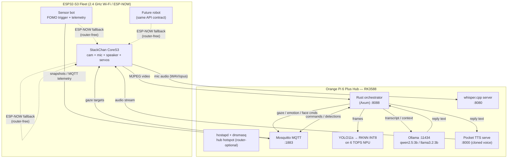
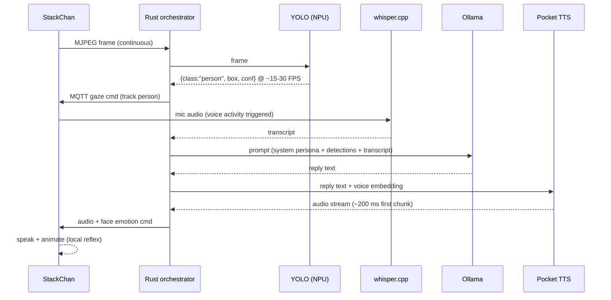

# PRD — StackChan "Local Mind"
### Offline Robot Perception, Voice & Fleet System

**Version:** 1.0 · **Date:** 2026-10-01 · **Owner:** Alejandro Garcia Romero

---

## 1. Vision

A fully local, internet-independent robotics system where an **Orange Pi 6 Plus (RK3588)** acts as the shared "mind" of a fleet of ESP32-S3 robots, headlined by **StackChan** (M5Stack CoreS3 desktop companion robot). The hub provides object detection (YOLO on the 6 TOPS NPU), conversation (Ollama), hearing (whisper.cpp), and a personalized cloned voice (Kyutai Pocket TTS). Every robot keeps local reflexes so the fleet degrades gracefully — it never goes dumb, even with no router and no internet.

**Design philosophy:** Rust/C++/Go core services; Python confined to throwaway export steps and isolated containerized microservices. Brains on the hub, reflexes on the bots. Local-first: LAN is the only network dependency, and even that has a fallback (hub-as-hotspot, ESP-NOW).

---

## 2. Goals & Non-Goals

### Goals

| # | Goal |
|---|---|
| G1 | StackChan sees objects via YOLO on the OPi NPU and speaks about them with a cloned personality voice |
| G2 | Full voice loop: speech → STT → LLM → TTS → speech, all on-device, no cloud |
| G3 | System works with **zero internet** and with **the home router offline** (hub = its own AP) |
| G4 | Hub orchestration written in **Rust**; robot firmware in C/C++ (Arduino + StackChan-BSP) |
| G5 | Fleet architecture: any robot (StackChan, future builds) drives via the same MQTT/REST contract |
| G6 | Detection-to-speech latency ≲ 2 s; camera-to-detection ≲ 300 ms |

### Non-Goals (v1)

- No cloud services of any kind (no ElevenLabs, no OpenAI, no cloud TTS/STT/LLM)
- No real YOLO on ESP32s (they get FOMO-class triggers only)
- No Japanese TTS in v1 (Pocket TTS has no ja voice yet; Piper `ja_JP` is the designated fallback if ever needed)
- No multi-hub mesh / robot-to-robot LLM negotiation (single hub, v1)
- No battery-powered outdoor operation

---

## 3. Hardware Inventory & Roles

| Device | Specs (relevant) | Role |
|---|---|---|
| **Orange Pi 6 Plus** | RK3588, 6 TOPS NPU (3 cores), 8-core CPU (4×A76 + 4×A55), Wi-Fi 6 + BT, NVMe | The hub: all AI services, MQTT broker, hotspot AP, orchestrator |
| **StackChan** (M5Stack) | CoreS3: ESP32-S3, 2×240 MHz, 16 MB flash, 8 MB PSRAM, 0.3 MP cam, dual mics, 1 W speaker, 2× servo (pan/tilt), 2" touch display | Primary robot: streams camera + mic, plays TTS audio, executes gaze/servo commands, runs face/UI locally |
| **ESP32-S3 fleet** (various boards) | Wi-Fi 2.4 GHz, ESP-NOW capable | Sensor/actuator bots; FOMO person-detection triggers; ESP-NOW telemetry |
| **Raspberry Pi 5** | Quad A76, no NPU | Development/bench board; secondary MJPEG consumer; backup hub candidate |
| **Raspberry Pi Zero 2 W** | Very constrained | Camera node only (streams to hub); no inference |
| **Desktop / x86 dev machine** | — | Model export, RKNN conversion, fine-tuning. Never part of runtime |

> ⚠️ **Hardware constraint (StackChan):** Y-axis (vertical) servo must stay within **5–85°**. Servo stalls from forced over-travel cause permanent damage. The gaze controller MUST clamp targets to this range.

---

## 4. System Architecture

**Conversation + perception sequence:**

---

## 5. Functional Requirements

### Perception
- **FR-P1** — The hub consumes an MJPEG stream (HTTP) from StackChan's camera and runs YOLO11s (RKNN INT8, 640 px) on the RK3588 NPU at ≥ 10 FPS sustained.
- **FR-P2** — Detections are published to MQTT `vision/detections/stackchan` as JSON: `{ts, class, conf, cx, cy, w, h}` (normalized 0–1 coordinates).
- **FR-P3** — The orchestrator maintains a **track state** per object class (presence, stability ≥ 5 consecutive frames, last position) before acting; single-frame ghosts are ignored.
- **FR-P4** — On stable person detection, the orchestrator computes a pan/tilt gaze target and publishes `stackchan/cmd/gaze` (clamped to servo limits).

### Voice loop
- **FR-V1** — Mic audio from StackChan is streamed to whisper.cpp (small model, int8) on the hub; transcript returned within ≲ 1 s for a short utterance.
- **FR-V2** — Orchestrator builds the LLM prompt from: fixed persona system prompt + current detection context + transcript; calls Ollama `/api/chat`.
- **FR-V3** — LLM reply is sent to Pocket TTS `serve` with the exported voice embedding; audio chunks stream back and are relayed to StackChan for playback.
- **FR-V4** — YOLO-triggered narration (no speech involved): detections → LLM one-liner → TTS → spoken, rate-limited to at most once per 30 s per event type.

### Robot control (StackChan firmware)
- **FR-R1** — Custom firmware built on **StackChan-BSP** (Arduino/C++): face rendering, servo control, touch events, Wi-Fi all run locally.
- **FR-R2** — Firmware hosts an MJPEG stream (camera) and a WAV/PCM audio upload endpoint (mic) over HTTP.
- **FR-R3** — Firmware subscribes to MQTT: `stackchan/cmd/{gaze,face,emotion,speak_audio}`; commands are queued and executed by the main loop (servo motion always smoothed, never stepped).
- **FR-R4** — On Wi-Fi loss > 30 s, firmware falls back to **autonomous idle mode**: idle animation + local FOMO/person-detection wake behavior; reconnects via hub hotspot SSID.

### Fleet & resilience
- **FR-F1** — Hub runs `hostapd` + `dnsmasq` providing SSID `localmind` (WPA2), DHCP `192.168.50.0/24`, hub at `192.168.50.1`. All devices store **two SSIDs**: home router (preferred) + hub hotspot (fallback).
- **FR-F2** — No service on the hub requires internet. Ollama models, YOLO weights, TTS voices are pre-downloaded and stored on NVMe.
- **FR-F3** — ESP32 bots publish telemetry via MQTT and can exchange small messages (commands, alerts) over **ESP-NOW** with no router (up to 20 peers; 250-byte payloads; all devices pinned to one fixed Wi-Fi channel).
- **FR-F4** — If the hub is unreachable, robots remain alive: StackChan idles + reacts to touch; ESP32 bots run local triggers and blink ESP-NOW alerts.

### Observability
- **FR-O1** — Orchestrator exposes `GET /health` and `GET /stats` (per-service latency, FPS, uptime) and logs structured NDJSON.
- **FR-O2** — MQTT retained message `hub/status` broadcasts service availability (robots can display hub state).

---

## 6. Non-Functional Requirements

| NFR | Target |
|---|---|
| End-to-end detect → gaze cmd | ≤ 300 ms (65 ms NPU + track smoothing + MQTT) |
| End-to-end spoken reply (user stops talking → first audio) | ≤ 2.5 s |
| TTS first audio chunk | ~200 ms (Pocket TTS design point) |
| Hub RAM budget | Ollama 3B ≈ 2–3 GB + whisper ≈ 1 GB + TTS ≈ 0.5 GB + orchestrator < 200 MB → 8 GB RAM board OK, 16 GB comfortable |
| CPU pinning | NPU preproc + whisper on A76 cores; pin via `taskset` in systemd units; A55 cores for OS/MQTT |
| Internet dependency | None at runtime |
| Router dependency | None at runtime (hub hotspot) |
| Robot liveness without hub | 100 % (local reflexes) |
| Language (v1) | English conversation; Pocket TTS `english` voice |

---

## 7. Service Contracts (the "unified mind" API)

### Ports & endpoints (hub)

| Service | Port | Key calls |
|---|---|---|
| Mosquitto MQTT | 1883 | pub/sub (see topics below) |
| Ollama | 11434 | `POST /api/chat` `{model, messages, stream:false}` |
| whisper.cpp server | 8080 | `POST /inference` (multipart WAV) → `{text}` |
| Pocket TTS `serve` | 8000 | `POST /v1/audio/speech`-style per repo docs; `GET /` web UI |
| YOLO NPU service | — | In-process (Rust FFI into `librknnrt.so`), not network-exposed |
| Rust orchestrator | 8088 | `GET /health`, `GET /stats`, `POST /say` (manual narration trigger), MJPEG proxy |

### MQTT topics

| Topic | Direction | Payload |
|---|---|---|
| `vision/detections/{src}` | hub → any | JSON array of detections |
| `stackchan/cmd/gaze` | hub → robot | `{pan: -1..1, tilt: 0..1, speed}` |
| `stackchan/cmd/face` | hub → robot | `{expression: "happy"\|"thinking"\|...}` |
| `stackchan/event/touch` | robot → hub | `{zone: 1..3}` |
| `stackchan/event/button` | robot → hub | `{id}` |
| `fleet/{id}/telemetry` | bot → hub | `{batt, rssi, trigger, uptime}` |
| `fleet/{id}/alert` | hub → bot | `{type, payload}` |
| `hub/status` | hub → all (retained) | `{services: {...}, uptime}` |

> **Contract rule (learned from sesame-robot):** any future robot that implements these topics is instantly part of the mind. Keep firmware a thin "body service"; never put logic above this API.

---

## 8. Component Design

### 8.1 Hub base (Orange Pi 6 Plus)
- **OS:** Ubuntu / Armbian aarch64 on NVMe; `librknnrt.so` (from `rockchip-linux/rknpu2`) installed to `/usr/lib`.
- **Hotspot:** `hostapd` (WPA2, channel 1, 2.4 GHz) + `dnsmasq` (DHCP + DNS). Fixed IP `192.168.50.1`.
- **Broker:** Mosquitto with local-only listeners (no WAN exposure), anonymous off, user/pass `localmind`.
- **All services run as systemd units** with `Restart=always`, CPU affinity via `CPUAffinity=`.

### 8.2 YOLO on NPU (Rust, in-process)
- Convert **yolo11s** ONNX → `.rknn` (INT8) with `rknn-toolkit2` on the dev machine (never on the board).
- Rust service loads the `.rknn` via FFI: `rknn_init` → `rknn_run`; NMS in Rust (`rayon` if needed); output → JSON detections.
- Fallback path: if RKNN conversion misbehaves, `yolov8s` and `yolov10n` from the same `rknn_model_zoo` are the battle-tested alternates.
- Track state machine: `candidate (1 frame) → stable (≥5 frames) → lost (absent 15 frames)`.

### 8.3 Voice services (isolated microservices)
- **STT:** whisper.cpp `server` example, `small` model (int8 q5), 16 kHz input; VAD on-robot (firmware only sends audio when voice detected).
- **LLM:** Ollama with `qwen2.5:3b` (primary) or `llama3.2:3b`; system prompt embeds persona + live detection context; `num_ctx` 4096.
- **TTS:** Pocket TTS in a container (`ghcr` image or `uv`-built venv), `serve` mode; **one cloned voice** exported via `export-voice` to a `safetensors` embedding loaded at startup. Non-English later via `--language` configs.
- Python appears **only** here and in conversion/export tooling — sealed behind HTTP.

### 8.4 StackChan firmware (Arduino + StackChan-BSP)
- Tasks: `main` (UI + servo smoothing @ 50 Hz), `wifi_mjpeg` (HTTP MJPEG server), `mic_stream` (ring buffer → hub on VAD), `mqtt` (subscription queue).
- Gaze controller converts normalized detection coords → servo angles with **hard clamps** (pan full range, tilt 5–85°) and slew-rate limiting.
- Idle/FOMO fallback mode when hub offline.

### 8.5 ESP32 fleet firmware
- MQTT telemetry + local FOMO person-detection (Edge Impulse exported Arduino library) as wake trigger.
- ESP-NOW group (fixed channel, paired MACs) for router-free alerts between bots and StackChan (ESP-NOW remote pattern already proven by StackChan's own remote controller).

---

## 9. Step-by-Step Build Guide

### Phase 0 — Bench & baseline (0.5 day)
1. Flash Armbian/Ubuntu on OPi 6 Plus (NVMe), create user, enable SSH.
2. Install `librknnrt.so` from `rknpu2` runtime; verify NPU visible (`dmesg | grep -i npu`, RKNPU version tool).
3. Clone `airockchip/rknn_model_zoo`; run the **yolo11** Python example as-is. **✅ Acceptance: detection demo runs from the repo's bundled model.**
4. Measure: NPU inference time per frame (expect ~65 ms @ 640 px). Record as baseline.

### Phase 1 — Hub services bring-up (1 day)
5. Install Mosquitto; create `localmind` user; test pub/sub with `mosquitto_sub/-pub`.
6. Install Ollama; `ollama pull qwen2.5:3b`; test `curl localhost:11434/api/chat`.
7. Build whisper.cpp (`server` example) with OpenBLAS/NEON flags; download `small` int8 model; test with a WAV.
8. Install Pocket TTS (isolated `uv` venv or container, CPU-only PyTorch); `pocket-tts serve`; test from the web UI; measure real-time factor on the board. **✅ Acceptance: all four services answer on the LAN from another machine.**

### Phase 2 — Voice embedding + persona (0.5 day)
9. Record a clean 15–20 s voice sample (good mic, quiet room) → `pocket-tts export-voice` → keep the `.safetensors` safe on NVMe + backup.
10. Write the persona system prompt (StackChan character, persona rules, language).
11. **✅ Acceptance:** `POST` a chat reply to Pocket TTS with the cloned voice; audio sounds consistent and fast.

### Phase 3 — Rust orchestrator core (2–3 days)
12. `cargo new localmind-hub` — workspace with crates: `orchestrator` (Axum), `vision` (RKNN FFI + NMS + tracker), `voice` (STT/LLM/TTS clients), `bus` (rumqttc MQTT).
13. Wire: MJPEG proxy ← robot; frame → vision; detections → MQTT; HTTP client wrappers for whisper/Ollama/TTS with timeouts + retries; NDJSON logging; `/health`, `/stats`.
14. **✅ Acceptance:** with a **static test video** fed as MJPEG, detections appear on `vision/detections/test`; `POST /say` makes the whole chain speak a sentence end-to-end (detections + transcript → LLM → TTS → WAV file).

### Phase 4 — StackChan firmware (2–3 days)
15. Flash stock StackChan firmware once (reference behavior), then install Arduino + ESP32 board support + **StackChan-BSP**.
16. Minimal custom firmware: face render + touch + servo sweep, MQTT connect to hub.
17. Add camera MJPEG server + mic streaming (VAD-gated); point orchestrator at it.
18. Gaze controller with clamps + smoothing. **✅ Acceptance:** person walks into frame → StackChan tracks them within ~0.5 s, within servo limits, no stalls.**

### Phase 5 — Offline resilience (1 day)
19. Configure `hostapd` + `dnsmasq` hotspot `localmind`; add second SSID profile to StackChan; test full voice loop with router unplugged and internet disconnected.
20. Add hub-offline idle mode on StackChan (timeout 30 s); verify graceful degrade/reconnect.
21. **✅ Acceptance:** unplug router and WAN mid-conversation — conversation completes; robot never freezes; reconnect is automatic.**

### Phase 6 — Fleet expansion (ongoing)
22. ESP32 bot: Edge Impulse FOMO person model → Arduino library; MQTT telemetry; ESP-NOW peer with StackChan.
23. Pin ESP-NOW channel = AP channel; pair MACs; test router-free alert path.
24. **✅ Acceptance:** sensor bot detects a person with hub offline → ESP-NOW alert reaches StackChan.**

### Phase 7 — Polish & hardening (ongoing)
25. systemd units for everything; boot-to-ready < 60 s.
26. Bench report: FPS, latency per stage, RAM, thermals (RK3588 throttling check — add heatsink/fan if sustained NPU+LLM loads throttle).
27. Later: fine-tune a custom YOLO class (Rockchip's Ultralytics fork → RKNN), Piper `ja_JP` fallback, sesame-style animation composer, Rust 3D sim.

---

## 10. Risks & Mitigations

| Risk | Likelihood | Mitigation |
|---|---|---|
| Pocket TTS slower than real-time on RK3588 CPU | Medium | Bench in Phase 1; use lightweight 6-layer model variants; worst case move TTS to RPi 5 / keep Piper fallback |
| YOLO11 RKNN conversion issues | Low-Med | Fallback to zoo-supported `yolov8s`/`yolov10n`; use Rockchip's Ultralytics fork for any fine-tuning |
| MJPEG bandwidth saturates Wi-Fi | Low | 320×240 stream @ 10 FPS for perception (640 crops optional); detection doesn't need full res |
| Ollama 3B too slow on RK3588 | Medium | CPU inference works but expect several tokens/s; keep replies short (persona rule); try `qwen2.5:1.5b` or RKLLM NPU runtime for 1–2B models as alternative |
| ESP-NOW unreliable through walls | Certain (physics) | Use it for alerts, not control; keep Wi-Fi MQTT as primary; consider LR mode |
| Servo stall from bad gaze targets | Medium | Hard clamp tilt 5–85° in **both** orchestrator and firmware (defense in depth) |
| Python services drift/break on update | Medium | Pin container image digests; never `latest`; services are stateless and restartable |

---

## 11. Test / Bench Checklist

- [ ] NPU inference ms per frame (target ≤ 100 ms)
- [ ] YOLO sustained FPS over 10 min (target ≥ 10)
- [ ] whisper small int8: time per 5 s utterance (target ≤ 1 s)
- [ ] Ollama 3B: tokens/s on A76 cores; first token latency
- [ ] Pocket TTS: real-time factor on-board; first-chunk ms
- [ ] End-to-end: spoken reply latency (target ≤ 2.5 s)
- [ ] Full loop with router + WAN unplugged: pass/fail
- [ ] StackChan 24 h soak: memory stable, no servo stall, auto-reconnect works
- [ ] ESP-NOW alert delivery rate across 2 rooms

---

## 12. Delivery Summary

| Milestone | Definition of done |
|---|---|
| M1 "It can see" | YOLO on NPU publishes detections from StackChan's live camera |
| M2 "It can talk" | Full voice loop with cloned personality voice, offline |
| M3 "It can survive" | Router + internet unplugged, everything still works |
| M4 "It has friends" | First ESP32 bot joins the fleet (MQTT + ESP-NOW) |
| M5 "It is durable" | systemd-managed, soak-tested, bench report written |

---

*Built from: m5stack/StackChan + StackChan-BSP, airockchip/rknn-toolkit2 + rknn_model_zoo, whisper.cpp, kyutai-labs/pocket-tts, Ollama, ultralytics (YOLO11/RKNN path), Mosquitto, hostapd — with architecture lessons from dorianborian/sesame-robot (API-first bodies, animation tooling, Rust simulation).*