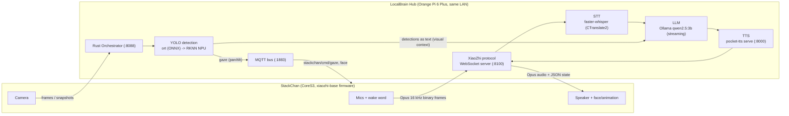

# PRD: StackChan Offline AI System — "Project LocalBrain"

**Version:** 1.1 · **Date:** 2026-10-04 · **Author:** Alejandro Garcia Romero + Vibe

> **v1.1 changelog:** Added Vision & Perception (Phase 8), current status snapshot for the `cynapse-bot` repo, decisions D8–D10, servo-model and vision risks, real repo layout. Sections 1–7 unchanged in substance.

---

## 1. Summary

Replace StackChan's dependence on the XiaoZhi cloud with a **fully local AI stack**. The robot (M5Stack CoreS3 / ESP32-S3) keeps doing what it is good at: microphone, wake word, speaker, face, servos, camera. All intelligence — STT, LLM, TTS, and vision — runs on a host machine (laptop or SBC) on the local network, reachable over Wi-Fi with **zero internet dependency**.

The hub speaks the **XiaoZhi WebSocket protocol** so the existing robot firmware (or a lightly modified variant) can connect without a ground-up firmware rewrite. Perception (YOLO) runs in a **Rust orchestrator** alongside the Python voice hub, keeping the "unified mind" architecture: ESP32 robots are spokes, the SBC is the brain.

---

## 2. Goals & Non-Goals

### Goals
1. StackChan holds a natural English voice conversation with **no internet connection**.
2. End-to-end voice latency (end of user speech → first speaker audio) **under 2.0 s** on the reference laptop; stretch goal 1.2 s.
3. Streaming at every stage: audio in → partial transcripts → LLM tokens → TTS chunks → speaker.
4. The robot keeps its personality: animations, servo motion, its own consistent voice.
5. Everything runs from open-source components; no cloud API keys anywhere.
6. **Vision (v1.1 scope, Phase 8):** StackChan sees and reacts — YOLO-based person/object detection drives gaze tracking and LLM narration; an optional small VLM describes a captured still **on demand only**.

### Non-Goals (v1)
- Japanese language support (English only in v1; keep the pipeline language-agnostic).
- Replacing the robot's Mooncake app framework, avatar renderer, or firmware UI.
- **Continuous VLM inference** — a VLM may run only on single captured stills, never per-frame (see D8).
- Full fine-tuning of YOLO with custom datasets (pretrained COCO classes only in v1).
- Multi-robot support.
- Porting the mobile app to the local hub.

---

## 3. Background — What the Code Review Established

| Fact | Source |
|---|---|
| StackChan firmware is ESP-IDF C++ (v5.5.4); `main.cpp` ends with `GetHAL().startXiaozhi()` — the AI agent **is** XiaoZhi, and it never returns. | [m5stack/StackChan](https://github.com/m5stack/StackChan) `firmware/main/main.cpp` |
| The firmware has no offline agent mode. "Offline" claims in marketing do not exist in code. | Same, full-tree review |
| The XiaoZhi WebSocket endpoint is **not permanently hardwired** — community firmware overrides it via NVS key `websocket.url` or Kconfig, and supports mDNS discovery (`_stackchan-mcp._tcp.local`). | [kisaragi-mochi/stackchan-mcp](https://github.com/kisaragi-mochi/stackchan-mcp), [eid390/stackchan-xiaozhi-firmware](https://github.com/eid390/stackchan-xiaozhi-firmware) |
| The reference architecture (dumb device + smart hub) is proven by OmniBot; Sesame proves the JSON-API/host-companion pattern. | [nazirlouis/OmniBot](https://github.com/nazirlouis/OmniBot), [dorianborian/sesame-robot](https://github.com/dorianborian/sesame-robot) |
| Pocket TTS: CPU-only, 100M params, ~2 cores, **~200 ms to first audio chunk**, faster than real-time, has a built-in `serve` HTTP mode, voice cloning from a WAV, English supported. | [kyutai-labs/pocket-tts](https://github.com/kyutai-labs/pocket-tts) |

---

## 4. Architecture



**One rule:** the hub is the brain, the robot is the body. Every component on the hub is independently testable without the robot.

---

## 5. Key Decisions (already made — do not re-litigate)

| # | Decision | Rationale |
|---|---|---|
| D1 | Speak the **XiaoZhi WebSocket protocol** from the hub instead of inventing a new one | Robot firmware already implements it; no rewrite; proven by community |
| D2 | **Python** for the hub | fastest-whisper, pocket-tts, Ollama bindings all first-class in Python |
| D3 | **faster-whisper** for STT | best CPU latency/accuracy trade-off; streams partial results |
| D4 | **Ollama** for LLM | simplest local serving; streaming; swap models freely |
| D5 | **pocket-tts** (`serve` mode) for TTS | CPU-only, streaming, low first-chunk latency, English ✓ |
| D6 | English only in v1 | pocket-tts has no Japanese; pipeline stays language-agnostic for v2 |
| D7 | Try **endpoint reconfiguration first** (Path A), community firmware flash second (Path B), full custom firmware fork only as last resort (Path C) | minimizes work, maximizes chance of keeping stock behaviors |
| D8 | **YOLO for scanning, VLM only on demand.** YOLO watches every frame cheaply and feeds detections *as text* to the text LLM; a small VLM (moondream / qwen-VL class) describes a captured still only when explicitly requested | a VLM per-frame is 100–1000× YOLO's compute and would destroy the latency budget on SBCs; YOLO covers presence/gaze/narration |
| D9 | Vision runs in the **Rust orchestrator**: `ort` (ONNX Runtime) with yolo11s ONNX on CPU first; RKNN/INT8 NPU conversion via FFI as a later optimization | get the pipeline correct on CPU first, quantize second; NPU is real-time-capable but a second step, never a dependency |
| D10 | The **voice hub stays Python** in v1; Rust owns orchestrator/vision/MQTT/fleet. Full-Rust voice is a Phase 7+ optimization, not a goal | faster-whisper, pocket-tts, ollama clients are Python-first; rewrite later only if measured bottlenecks justify it |
| D11 | All robot speech flows through the **XiaoZhi voice hub**, never as audio payloads over MQTT; MQTT carries only commands/telemetry (gaze, face, telemetry) | MQTT audio is the wrong tool (hundreds of KB per reply, no playback path in firmware) |

---

## 6. Requirements

### Hardware
- M5Stack StackChan (CoreS3 SKU K151), USB-C power.
- **Host fleet tiers** (Alejandro's actual boards; assign roles, don't buy more for v1):
  - **Tier 1 — daily brain: Orange Pi 6 Plus (RK3588).** Fastest CPU of the fleet; best LLM token rates. Plan **CPU-only inference first** — the 6 TOPS NPU does not accelerate Ollama/llama.cpp out of the box (needs RKNN/NeuralONE model conversion; investigate later, Phase 7).
  - **Tier 2 — development host: Raspberry Pi 5.** Best software ecosystem for building/debugging the hub. Acceptable for dev, but ~2–4 tok/s on 3B models makes it below the latency budget as the daily brain.
  - **Tier 3 — portable companion (future): Orange Pi Zero 3W, 12 GB.** Fine for travel duty with a 3B model; needs active cooling for continuous chat.
  - **Tier 4 — controller: Raspberry Pi Zero 2 W.** Never an LLM/STT host. Use as wake-word node, button/sensor hub, or MQTT relay (fits the "unified mind" ESP32 fleet plan).
  - A laptop is still the preferred Phase 0–6 development machine (fastest iteration, best debugging); migrate to Tier 1 after Phase 6.
- LAN: Wi-Fi router reachable by both robot and host. Host has a **static LAN IP** (or reserved DHCP lease) — e.g. `192.168.1.50`.

### TTS note per board
- **pocket-tts** requires PyTorch — fine on Tier 1–3 boards (≥4 GB RAM); impossible on the Zero 2 W (512 MB).
- If a board can't run pocket-tts comfortably, **Piper** is the sanctioned lightweight fallback (streams, tiny footprint, lower quality). Never required on Tier 1/2.

### Software (host)
- Ubuntu 22.04+ / macOS / Windows with WSL2.
- Python 3.11+, `uv` (recommended package runner).
- Docker (optional, for Ollama).

### Skills / access
- Ability to flash the robot over USB-C (ESP-IDF or esptool) — only needed for Path B/C.

---

## 7. Interface Spec — What the Hub Must Implement (XiaoZhi protocol, subset)

The hub exposes `ws://<host-ip>:8000/xiaozhi/v1/` (confirm the exact path against the firmware build in Phase 0 — the community builds use `/xiaozhi/v1/`).

1. **Text frames = JSON. Binary frames = Opus audio, 16 kHz, mono, 60 ms frames.**
2. On connect, the device sends a `hello` message (session id, device info, audio params). Reply with `hello` + `goodbye` negotiation as needed.
3. Device sends `listen` state messages (`{"state":"detect","text":...}` / `"start"` / `"stop"` / `"detect"`).
4. Hub responsibilities:
   - Accumulate binary Opus frames during `listen start → stop`, decode to 16-bit PCM, feed STT.
   - When the user finishes speaking, run LLM, then send `tts start → sentence start → audio chunks → sentence end → tts stop`.
   - Optionally send `stt` messages with live transcripts.
5. **Interruption (barge-in):** if new `listen start` arrives during playback, immediately drop pending audio, cancel the pipeline, and restart listening. Non-negotiable for a good demo.

> ⚠️ Phase 0 verifies the exact message shapes your firmware build emits. Treat this section as the shape of the contract, and pin the real payloads to a fixtures file (`tests/fixtures/`) captured from a real session.

---

## 8. Step-by-Step Build Plan

Each phase has **Steps** and a **Definition of Done (DoD)**. Do not start the next phase until the DoD passes.

### 8.0 Current Status Snapshot — `cynapse-bot` (updated 2026-10-04)

Phases 1–6 are **substantially implemented** in [Alartist40/cynapse-bot](https://github.com/Alartist40/cynapse-bot) (Rust orchestrator + Python hub + MQTT firmware), including two rounds of review fixes (commits `01036c5`, `0cd5cf5`, `4bf29fa`: streaming TTS, hello/OTA/goodbye handlers, stateful audio pacer, streaming 24k→16k resampler, `/say` lightweighting, dead-path cleanup, tokio Mutex). Remaining gaps, in work order:

| # | Gap | Phase | Status |
|---|---|---|---|
| 1 | **Firmware can't reach the voice hub**: `stackchan_localmind.ino` speaks MQTT only — no XiaoZhi WebSocket client. Merge the MQTT gaze/face subscriber into a xiaozhi-based firmware (stock or [eid390](https://github.com/eid390/stackchan-xiaozhi-firmware) build) instead of keeping the standalone `.ino` | 2 | 🔴 open — **next up** |
| 2 | **Verify servo model**: pan axis may be a 360° continuous-rotation feedback servo — angle writes (`servoPan.write(angle)`) would become speed control, breaking gaze tracking | 2/8 | 🔴 open (documented in firmware comments; physical verification pending) |
| 3 | ~~TTS non-streaming~~ Progressive Opus streaming + stateful pacer (burst→55 ms/frame) + `aclose()` cleanup | 5 | ✅ resolved (`4bf29fa`) |
| 4 | ~~Hello/OTA gaps~~ `version` echo, `features: {"mcp": false}`, `ota → up_to_date`, `goodbye` handler | 1 | ✅ resolved (`01036c5`) — re-verify against a real device handshake |
| 5 | **No real YOLO inference**: `detector.rs` returns empty in real mode; wire `ort` + yolo11s ONNX, then camera source | 8 | 🟡 open |
| 6 | **No camera feed source**: nobody POSTs to `/api/vision/frame`; start with a USB webcam on the SBC, ESP32-CAM spokes later | 8 | 🟡 open |
| 7 | ~~`/say` MQTT audio path~~ `/say` now publishes lightweight `SayCommand` JSON + face; no WAV over MQTT (D11) | 5 | ✅ resolved (`4bf29fa`) |
| 8 | ~~Config default mismatch~~ Documented host-loopback (`127.0.0.1`) vs robot LAN/hotspot broker IP (`192.168.1.50` / `192.168.50.1`) | 2 | ✅ resolved (`948f74e`) |

**Note on the resolved items:** gaps #3/#4/#7 were fixed, then a review pass found two regressions (pacing defeated by per-frame calls; sample-rate assumption with no resampling) — both were fixed properly in `4bf29fa` (stateful pacer + `StreamingWavDecoder` with RIFF parsing and phase-preserving 24k→16k resampling, tested across 1 B–64 KB chunk sizes). Lesson encoded: **every "resolved" protocol/audio item must be re-validated against a real device session, not only unit tests.**

#### 8.0.1 Gap #1 Execution Plan (firmware integration)

**Order of operations — validation before firmware work:**

1. **Phase 0 recon on the physical robot** (30 min): M5Burner + esptool backups; determine whether the stock build's WebSocket endpoint is configurable (app settings / NVS `websocket.url` / Kconfig). Record in `docs/phase0-findings.md`. This single answer sizes the whole firmware effort.
2. **Hub pre-flight** (no robot): run all four services live (Ollama, pocket-tts `serve`, mosquitto, hub) + `fake_device.py` full turn; verify with `curl --no-buffer` that pocket-tts `/tts` flushes progressively (if it buffers the whole response, the streaming pipeline is correct but latency-neutral — know this before blaming the robot).
3. **Real robot echo session** (Path A if settable, else eid390 flash): robot mic → hub → robot speaker. Capture the real `hello`/`listen`/OTA payloads into `tests/fixtures/` and diff against the hub's handlers. Only then is gap #4 truly closed.
4. **Merge firmware** (the dual-channel spoke): MQTT body-control task + XiaoZhi voice in one build.

**Firmware merge rules (when step 4 is reached):**

- **Base firmware: official `m5stack/StackChan` preferred** (Mooncake, animations, dances, calibration, `hal_mcp` — the whole personality). eid390 build only as escape hatch for a locked endpoint.
- **Trap:** in official `main.cpp`, when `startAiAgentOnBoot` is set, Mooncake is skipped and `startXiaozhi()` never returns → a Mooncake-app MQTT spoke never starts. Launch the MQTT spoke from HAL init, not as an app.
- Disable Wi-Fi power save (`esp_wifi_set_ps(WIFI_PS_NONE)`) — modem sleep adds 100–300 ms to MQTT delivery and fakes "broken" gaze tracking.
- Pin tasks: audio pipeline on one core; MQTT spoke lower-priority on the other core. Random audio dropouts are usually priority starvation.
- Verify the pan servo type (positional vs continuous, 1500 µs neutral) **before** writing `servoPan.write()` control code — it decides angle-positioning vs speed+feedback control.

---

### Phase 0 — Recon & Safety Net (half a day)

**Steps**
1. Create the project: `git init stackchan-localbrain` with `hub/` and `docs/` folders.
2. Power the robot, connect it to your LAN using the stock app flow, confirm it reaches the XiaoZhi cloud and talks normally. This is your known-good baseline.
3. Watch the network: from the laptop, run a packet capture / check the router client list — find the robot's IP and (if visible) the WebSocket host it connects to.
4. **Backup the official firmware before touching anything** (two options):
   - **M5Burner (recommended, easiest):** in M5Burner select the StackChan product, download the official firmware, and note the flash settings it lists. This downloaded image is your recovery copy.
   - **esptool (full dump, includes your saved Wi-Fi/config):** `esptool.py --chip esp32s3 --port /dev/ttyUSB0 read_flash 0x0 0x1000000 flash_backup.bin` (16 MB flash → `0x1000000`).
   Keep both if you can. If a flash goes wrong, hold the robot's reset/G0 button to enter **download mode** and reflash the official firmware — bad code can freeze or boot-loop the robot, but does not permanently brick it. Never unplug mid-flash.
5. Check whether your firmware build exposes a **configurable WebSocket URL** (search the firmware repo / community docs for `websocket.url`, NVS, or the app's agent settings). Record the finding in `docs/phase0-findings.md`.
6. Decide the connection path:
   - **Path A** — endpoint is configurable → keep stock firmware.
   - **Path B** — not configurable → flash [eid390/stackchan-xiaozhi-firmware](https://github.com/eid390/stackchan-xiaozhi-firmware) or a similar community build that forces a custom WebSocket URL via Kconfig/NVS.
   - **Path C** — fork `m5stack/StackChan` firmware and patch the XiaoZhi endpoint constant.

**DoD:** You have (a) a firmware backup file, (b) the robot's IP and your host's static IP, (c) a written answer to "is the WebSocket URL configurable in my build?", (d) a chosen path A/B/C.

---

### Phase 1 — Hub Skeleton: Echo Server (1 day)

**Steps**
1. `uv init hub && cd hub` — add `websockets`, `numpy`, `soundfile`.
2. Implement `hub/server.py`: WebSocket server on `ws://0.0.0.0:8000/xiaozhi/v1/`.
   - Accept connections, log every text frame to `docs/protocol-log.jsonl`.
   - Reply to `hello`.
   - **Echo mode:** decode incoming Opus frames and immediately re-encode + send them back as `tts` audio. (Simplest possible end-to-end audio test.)
3. Add a **fake device** test script (`tools/fake_device.py`) that connects, says `hello`, streams a WAV as Opus frames, and plays back what it receives — so you can iterate without the robot on your desk.
4. Keep `docs/protocol-log.jsonl` — it becomes your protocol fixtures.

**DoD:** `fake_device.py` talks to the hub and hears its own audio echoed back. Hub survives 10 minutes of streaming without crashing. You have captured real `hello`/`listen` JSON samples.

---

### Phase 2 — Point the Robot at the Hub (half a day)

**Steps**
1. Start the hub: `uv run python hub/server.py` on the host with the static IP.
2. Path A: set the endpoint in the firmware/app config to `ws://192.168.1.50:8000/xiaozhi/v1/`.
   Path B: flash community firmware with the URL baked in via Kconfig.
   Path C: build `m5stack/StackChan` with ESP-IDF v5.5.4 after patching the endpoint (`python3 ./fetch_repos.py && idf.py build && idf.py flash`).
3. Say the wake word. Talk. You should hear **your own voice echoed back** from StackChan's speaker.
4. Save the captured real session JSON to `tests/fixtures/`.

**DoD:** Full audio round-trip with the physical robot: mic → hub → speaker. No cloud (verify by blocking internet on the router — it must still work).

---

### Phase 3 — Real STT (1 day)

**Steps**
1. `uv add faster-whisper` (CTranslate2 backend, CPU). Model: `small` to start (good accuracy/latency; drop to `base` if slow, rise to `medium` only on GPU).
2. Implement `hub/stt.py`: PCM in (16 kHz mono) → partial transcripts → final transcript. Log all transcripts.
3. In `server.py`, replace echo: on `listen stop`, run STT and print the final text to console. (No LLM yet.)

**DoD:** You speak to the robot and see an accurate English transcript appear in the hub console within ~1 s of stopping speech.

---

### Phase 4 — LLM via Ollama (1 day)

**Steps**
1. Install Ollama (`curl -fsSL https://ollama.com/install.sh | sh`). Pull a small chat model: start with `qwen2.5:3b-instruct` (fast, good English) or `llama3.2:3b`; upgrade to `qwen2.5:7b` if the host is comfortable.
2. `uv add ollama` (official Python client). Implement `hub/llm.py`: transcript in → **token stream** out. Keep the generation cancelable (interruption).
3. Write the system prompt persona (`hub/persona/system.md`): StackChan is a cheerful, witty desktop companion; keep spoken replies short (1–3 sentences), no markdown, no emoji in speech.
4. In `server.py`: STT final → LLM tokens → **print tokens to console** (no TTS yet). Buffer tokens into sentence-sized chunks (split on `. ! ?` and >80-char soft limit).

**DoD:** Speak a question; console streams a sensible spoken-style answer token by token. Total STT+LLM time under ~1.5 s to first token.

---

### Phase 5 — TTS with Pocket-TTS, streaming (1–2 days)

**Steps**
1. CPU-only PyTorch note (Linux): follow the pocket-tts "CPU-only installation" section to avoid pulling CUDA.
2. Run the service: `uvx pocket-tts serve` (default `http://localhost:8000` → change hub port to avoid collision, e.g. run hub on `8100` and pocket-tts on `8000`, or vice versa — pick one and write it into `docs/ports.md`).
3. Implement `hub/tts.py`: for each sentence chunk from Phase 4, POST text to pocket-tts `serve`, receive WAV/PCM chunks, convert to 16 kHz mono, encode Opus, and send `tts start / sentence start / audio / sentence end / tts stop` frames to the robot.
4. Pick a voice: try catalog voices (`alba`, `vera`, …) or clone one from a clean 10–20 s WAV. Record the choice in `hub/config.yaml`.
5. Pipe robot motion: on `tts start`, trigger StackChan's talk animation/servo gesture via the protocol's emotion/motion messages (verify exact support in your firmware build; optional).

**DoD:** Full conversation with the robot, fully offline: wake word → question → streamed spoken reply. Latency stopwatch: end of speech → first speaker audio ≤ 2.0 s.

---

### Phase 6 — Interruption, State & Polish (2–3 days)

**Steps**
1. **Barge-in:** on `listen start` during `tts`, cancel LLM generation, flush TTS queue, send `tts stop`, resume listening. Test by interrupting mid-sentence.
2. Conversation memory: keep last N exchanges in a ring buffer per session; include in LLM context.
3. Idle behavior: if no speech for X minutes, hub may send a short proactive line (optional, off by default).
4. Error handling: robot disconnects → hub frees resources; hub restart → robot auto-reconnects (verify reconnect behavior of firmware).
5. Config file `hub/config.yaml`: host ports, model names, voice name, persona path, latency knobs. No hardcoded values.
6. Latency instrumentation: log timestamps at speech-stop / transcript / first LLM token / first audio chunk into `docs/latency-log.jsonl`.

**DoD:** You can interrupt the robot naturally mid-answer and it stops instantly. Two 10-minute conversations with zero crashes. Latency log shows the budget below being met.

---

### Phase 7 — Hardening & Optional Extras (ongoing)

Choose freely; none block "project done":
- systemd service / Docker Compose for the whole hub (auto-start on boot).
- mDNS advertisement of the hub (`_xiaozhi._tcp.local`) so the robot finds the hub without a hardcoded IP.
- Persona upgrades: longer-term memory notes, time-of-day greetings (OmniBot-style persona files).
- MCP tools: let the LLM trigger StackChan dances/emotions (the firmware already has an MCP layer — `hal_mcp`).
- Migrate host to SBC (Tier 1: Orange Pi 6 Plus) — re-run Phase 6 latency budget there before committing.
- StackChan's stock delights worth porting once stable: **calibration routine**, **dance choreography** (drive via MQTT commands or MCP tools), **picture taking** (snapshot → VLM description, Phase 8 step 6).

---

### Phase 8 — Vision & Perception (v1.1, 3–5 days)

**Steps**
1. **CPU-first YOLO in Rust** (no NPU yet): export `yolo11s` to ONNX once (`yolo export format=onnx` in a throwaway Python/container env — Python is a one-time export tool, never shipped). In the orchestrator, wire `ort` into `vision/detector.rs`: image decode → preprocess (letterbox/resize to 640) → `session.run()` → NMS → `Vec<Detection>` (struct already exists).
2. **Camera source (simplest first):** USB webcam on the SBC (`rscamera`/`v4l2`), a capture loop POSTing JPEG frames to `/api/vision/frame` every ~200–500 ms. Do **not** stream camera frames over Wi-Fi from the robot in v1 — it competes with voice Opus for airtime.
3. **Close the gaze loop:** detections → existing `VisionTracker` (state machine, smoothing, 5–85° clamps already done and tested) → MQTT `stackchan/cmd/gaze` → firmware servos. Verify servo model (snapshot gap #2) **before** trusting pan positioning.
4. **Detection-driven narration:** detections as compact text ("1 person center, 1 cup left") injected as `visual_context` into the LLM (hub already supports it) or via `trigger_vision_narration` (30 s rate limit already implemented). Never block the voice pipeline on vision — narration is async and rate-limited.
5. **(Optional, later) NPU:** convert yolo11s → RKNN INT8 with `rknn-toolkit2` (model zoo supports v5/v8/v10/11; use Rockchip's Ultralytics fork for fine-tunes), call `librknnrt.so` from Rust via FFI. Real-time territory (~65 ms/frame reported for YOLO11 on RK3588 NPU). Treat as optimization, never a dependency (D9).
6. **(Optional) VLM on demand:** "take a picture and describe it" → capture one still → small VLM in Ollama (moondream for tiny footprint, qwen-VL class for quality) → reply through the normal voice pipeline. One image, on demand only (D8).
7. **(Future, fleet)** ESP32-S3 spokes get FOMO / ESP-DL person-detection as always-on local triggers ("someone is here") and stream snapshots to the hub on motion; the Zero 2 W can be a wake/relay node. Adding a robot adds only a spoke.

**DoD:** Robot physically tracks a person walking across the room (gaze follows, clamps respected, no servo grind); it occasionally narrates what it sees without you speaking ("I see you've got coffee again"); a spoken "what do you see?" answers from live detections. Latency budget from Section 9 is **unaffected** (vision narration never blocks a voice turn).

---

## 9. Latency Budget (target: ≤ 2.0 s speech-end → first audio)

| Stage | Budget | Notes |
|---|---|---|
| VAD/speech-end detection | ~200 ms | firmware-side |
| STT (faster-whisper `small`, CPU) | ~400–700 ms | final transcript |
| LLM first token (qwen2.5:3b) | ~200–400 ms | short system prompt, limited history |
| TTS first chunk (pocket-tts) | ~200–300 ms | sentence-level chunking keeps input short |
| Network + encode | ~50–100 ms | LAN, Opus |
| **Total** | **~1.1–1.7 s** | |

If over budget: shorten persona/history, smaller STT model, force short first sentence in the persona ("answer the first sentence fast, then elaborate").

---

## 10. Acceptance Criteria (the definition of "done")

1. ✅ Router internet blocked → StackChan still converses.
2. ✅ End-to-end speech latency ≤ 2.0 s (median of 10 measured turns).
3. ✅ Interruption works: robot stops speaking within ~200 ms of user speech.
4. ✅ 30-minute conversation session with no hub crash or stuck state.
5. ✅ Hub restarts cleanly; robot reconnects without a power cycle.
6. ✅ Stock behaviors intact: wake word, face animation, at least the talk motion.
7. ✅ No cloud API keys or external calls anywhere in the repo (`grep -ri "api_key" hub/` clean).

---

## 11. Risks & Mitigations

| Risk | Impact | Mitigation |
|---|---|---|
| Stock firmware's XiaoZhi endpoint is NOT configurable (Path A fails) | +2–3 days (must flash) | Phase 0 answers this before any hub work; community firmware (eid390 build) already solves it |
| Protocol drift between firmware builds | Hub won't handshake | Phase 1 fixture capture from your exact build; echo server validates before adding brains |
| CPU contention: STT + LLM + TTS fight for cores | Latency spikes | pocket-tts needs ~2 cores; pin processes with `taskset`/nice; choose 3B LLM; measure in Phase 6 |
| SBC hub slower than dev laptop (e.g. Pi 5 ~2–4 tok/s on 3B) | Latency budget blown when migrating off laptop | Re-run the Phase 6 latency suite on the SBC before declaring it the daily brain; prefer Tier 1 (Orange Pi 6 Plus); shrink model/persona if needed |
| RK3588 NPU tempting but unsupported by llama.cpp directly | Wasted days | Treat NPU/RKNN acceleration as a Phase 7+ experiment, never a dependency |
| Opus encode/decode on host adds latency | Minor | Use `pyopuslib`/libopus via `av` or ship decoding to `numpy`-based lib; budget includes 100 ms |
| Robot speaker quality limits TTS clarity | Perceived quality | pocket-tts output is 24 kHz — downsample to 16 kHz; test voices on the actual speaker, not laptop speakers |
| Faster-whisper `small` accuracy on accents | Wrong words | Test early with your own voice in Phase 3; upgrade model size on desktop-class CPU |
| Hub machine sleeps / IP changes | Robot loses brain | Static IP, disable sleep, systemd keep-alive (Phase 7) |
| **Pan servo is continuous-rotation** (per M5Stack's own spec), so angle writes act as speed/direction, not position | Gaze tracking misbehaves or servo grinds | Verify against StackChan-BSP servo driver before Phase 8 gaze tests; if continuous, switch pan to speed control + position feedback |
| YOLO is closed-vocabulary (~80 COCO classes); can't find "my mug" | Narration feels blind to your stuff | Acceptable in v1; open-vocabulary detectors (YOLO-World, Grounding DINO) as later upgrade; or one-shot fine-tune with Rockchip's Ultralytics fork for NPU |
| Vision thread competes with voice services for CPU | Voice latency spikes | USB webcam at 200–500 ms cadence, not video rate; pin YOLO/voice to disjoint cores (`taskset`); on Tier 1 use the NPU for YOLO instead of CPU |
| MQTT audio temptation (large payloads, PubSubClient 256 B buffer) | Silent speaker, dropped payloads | D11: speech goes through the XiaoZhi hub only; MQTT stays commands/telemetry |

---

## 12. Open Questions (resolve during Phase 0/1)

- [ ] Exact WebSocket path and `hello` payload of **my** firmware build (capture, don't assume) — including OTA/goodbye handling.
- [ ] Does my build support setting the agent endpoint from the mobile app, or only via reflash?
- [ ] Which wake word engine does the build use, and can hub-side messages change emotion/pose (MCP) during `tts`?
- [ ] **Servo model on my unit:** is pan truly continuous-rotation? Does the BSP expose position feedback? (blocks Phase 8 gaze)
- [ ] Host hardware final choice: laptop vs SBC (decide after Phase 6 measurements — planned: Orange Pi 6 Plus).
- [x] ~~Vision approach~~ — resolved: YOLO always-on + VLM on demand (D8/D9).

---

## Appendix A — Reference Stack (pinned at PRD time)

| Component | Version/Model | Role |
|---|---|---|
| StackChan firmware | m5stack/StackChan `main` (Aug 2026) or community xiaozhi build **+ merged MQTT gaze/face subscriber** | Robot, XiaoZhi client + MQTT body control |
| Hub runtime | Python 3.11+ via `uv` (voice) · Rust (orchestrator/vision/fleet) | Orchestration |
| WebSocket | `websockets` (asyncio) | XiaoZhi protocol endpoint (:8100) |
| STT | faster-whisper, model `small` (int8) | Speech → text |
| LLM | Ollama + `qwen2.5:3b-instruct` | Reasoning, streaming, narration |
| TTS | pocket-tts `serve` (:8000), voice `alba` or clone | Text → streamed speech |
| Vision | yolo11s ONNX via Rust `ort` (CPU) → RKNN INT8 on RK3588 NPU (Phase 8.5) | Detection → gaze + narration context |
| VLM (on demand) | moondream or qwen-VL class via Ollama | Single-still descriptions (never per-frame) |
| MQTT | Mosquitto (:1883), `rumqttc` client | Commands/telemetry: `stackchan/cmd/#`, `stackchan/event/#`, `fleet/+/telemetry` |
| Opus | libopus via `opuslib` | Audio framing (16 kHz mono, 60 ms) |
| Config | single `hub/config.yaml` + `Cargo.toml` | Ports, models, voice, persona |

## Appendix B — Actual repo layout (`cynapse-bot`, current)

```
cynapse-bot/
├── src/                      # Rust orchestrator (:8088)
│   ├── main.rs               # Entry: config, MQTT bus, status publisher
│   ├── api/mod.rs            # Axum: /health, /stats, /say, /api/vision/frame
│   ├── bus/mqtt.rs           # rumqttc auto-reconnect + subscriptions
│   ├── vision/
│   │   ├── detector.rs        # YOLO (stub → ort ONNX in Phase 8)
│   │   └── tracker.rs         # Track state machine + 5–85° clamps (done, tested)
│   ├── voice/                # Orchestrator-side narration clients (STT/LLM/TTS)
│   └── config.rs
├── hub/                      # Python XiaoZhi voice hub (:8100)
│   ├── server.py             # Protocol, sessions, barge-in (done)
│   ├── audio.py              # Opus codec + WAV/PCM utils (done)
│   ├── stt.py / llm.py / tts.py   # Engines (tts.py needs streaming fix, gap #3)
│   ├── config.yaml
│   └── persona/system.md
├── firmware/stackchan/
│   ├── stackchan_localmind.ino   # MQTT-only reference; to be merged into a
│   └── config.h.example          #   xiaozhi-based firmware (gap #1)
├── tests/                    # Rust unit tests + test_hub.py (extend w/ fixtures)
└── docs/ports.md, protocol-log.jsonl, latency-log.jsonl
```